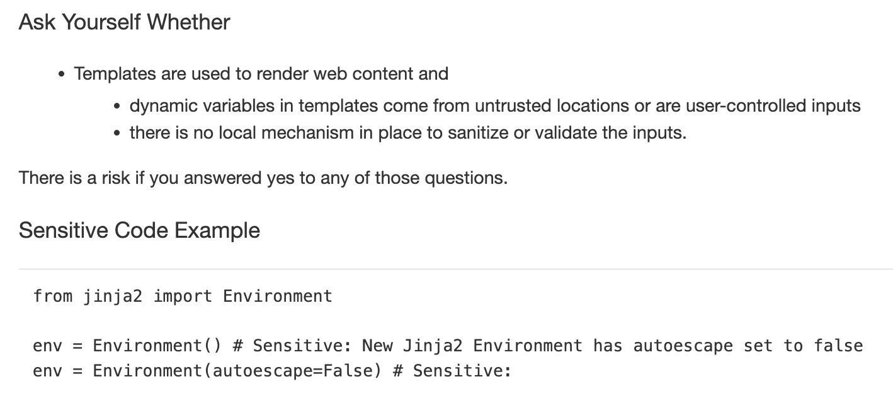
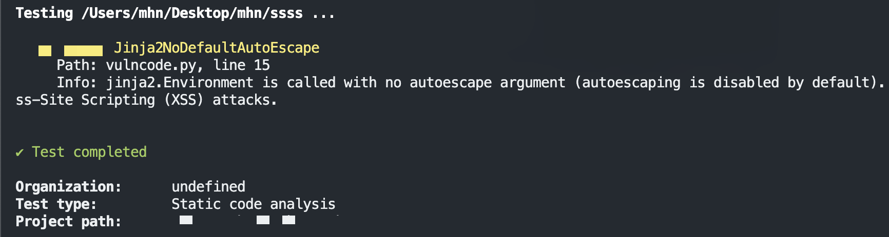
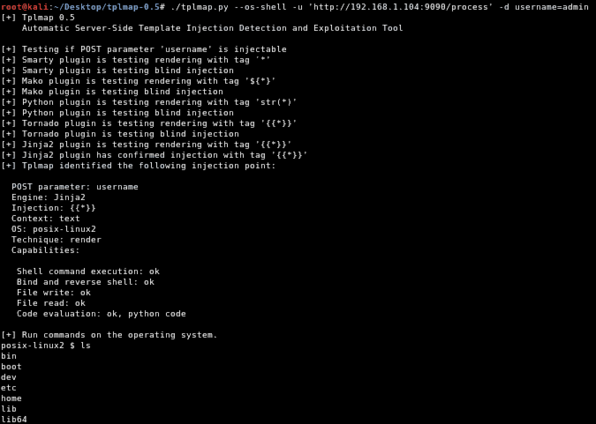
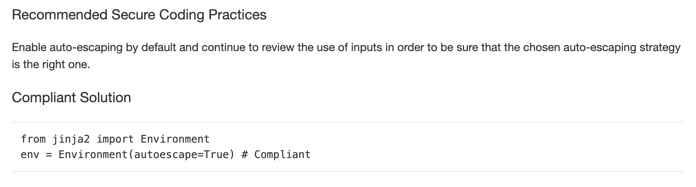

# Python-Jinja-TemplateInj2

If the app blindly takes a user input (such as username) and render it into a template. Then the user can inject arbitrary code which the template will evaluate.

Such injection, will allow the user to access some APIs and methods which are not supposed to.

**How to discover the flaw❓**

Usually manually, with trial and error. If we don’t know the type of the template engine, then we inject a set of various template syntax. Portswigger provides an extensive approach to spot the vulnerability with different template types.

For this demo, I will be using Python and Jinja template.

In Jinja, 

    if you pass an operation like {{7*7}} and the app evaluated 7*7 and returned 49

Jinja2 is a full featured template engine for Python. It has full unicode support, an optional integrated sandboxed execution environment, widely used and BSD licensed.

            {{7*7}} = Error
            ${7*7} = ${7*7}
            {{foobar}} Nothing
            {{4*4}}[[5*5]]
            {{7*'7'}} = 7777777
            {{config}}
            {{config.items()}}
            {{settings.SECRET_KEY}}
            {{settings}}
            
            
## Owasp

https://owasp.org/www-project-web-security-testing-guide/v41/4-Web_Application_Security_Testing/07-Input_Validation_Testing/18-Testing_for_Server_Side_Template_Injection

## PortSwigger

https://portswigger.net/web-security/server-side-template-injection#constructing-a-server-side-template-injection-attack

## SAST Tools : 

Find With SAST Tools : Sonar Develper plans

Find With SAST Tools : Snyk Enterprise plans

## Setup

install from my dockerhub : https://hub.docker.com/r/mhnamadi/noorassti

    docker run -itd -p 9090:60 mhnamadi/noorassti python /root/vulncode.py

## Payload 

    https://github.com/swisskyrepo/PayloadsAllTheThings/blob/master/Server%20Side%20Template%20Injection/Intruder/ssti.fuzz

## Attack HELP

    http://blog.portswigger.net/2015/08/server-side-template-injection.html
    https://github.com/epinna/tplmap/issues/9
    http://disse.cting.org/2016/08/02/2016-08-02-sandbox-break-out-nunjucks-template-engine
    https://artsploit.blogspot.co.uk/2016/08/pprce2.html
    http://jinja.pocoo.org/
    http://flask.pocoo.org/
    https://opsecx.com/index.php/2016/07/03/server-side-template-injection-in-tornado/

## Fix Guide :  

## Contributing : 
 
We encourage you to contribute to Project

## Twitter & Facebook Contributor :

   https://www.linkedin.com/in/omid-shojaei
   
   https://twitter.com/dmitriy_area51

  
## Report 

